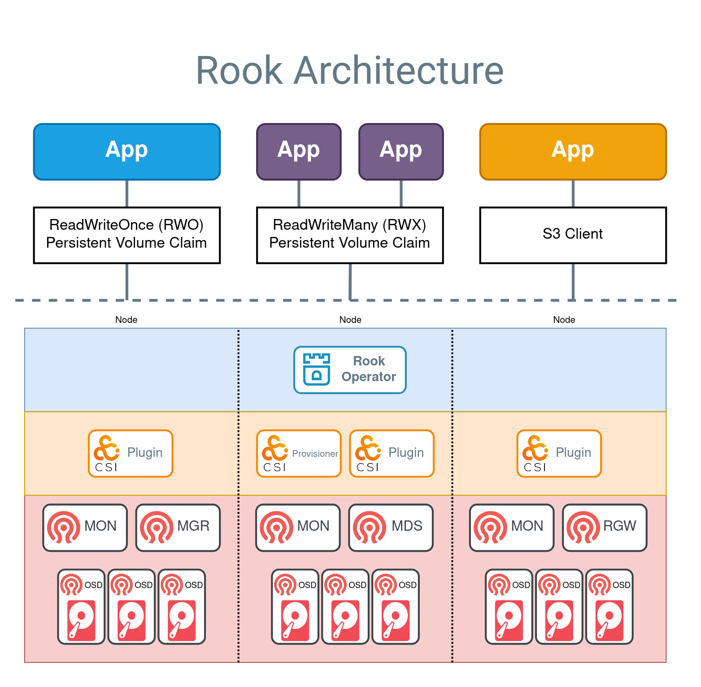

# CEPH-ROOK và triển khai ceph lên k8s.

## ROOK:
- Rook là một open-source storage orchestrator, được thiết kế để tạo, cấu hình và quản lý các giải pháp lưu trữ phân tán trên nền tảng K8s. Rook giúp đơn giản hóa việc triển khai và vận hành các hệ thống lưu trữ như Ceph, NFS, Minio, Cassandra, Yugabyte và nhiều giải pháp khác.

- Ceph ban đầu không được thiết kế cho k8s, mà ta phải chạy trực tiếp lên trên bare metal environments thông qua ceph-ansible.

- Sau này, khi các môi trường container dần được phát triển, ceph bắt đầu hỗ trợ môi trường này.

- Rook được sinh ra để triển khai ceph trên kubernetes. Nó giống như cephadm, là 1 lớp quản lý ceph. Có thể tự động triển khai ceph điều chỉnh tùy ý.
- Cấu trúc của một cụm CEPH - ROOK sẽ gồm 3 phần như sau:
 

- Rook Operator (lớp xanh dương): Rook Operator là một container đơn giản, có tất cả những gì cần thiết để khởi tạo và giám sát cluster storage. Nó tự động hóa việc cấu hình và điều khiển các thành phần Ceph trên Kubernetes. Nó chịu trách nhiệm triển khai, cấu hình và quản lý toàn bộ Ceph cluster.
- CSI plugins và provisioners (lớp cam): Đây là các plugin và provisioner của Ceph-CSI (Container Storage Interface). Chúng cung cấp khả năng cung cấp và gắn kết các khối lưu trữ Ceph vào các Pod Kubernetes. Rook tự động cấu hình trình điều khiển Ceph-CSI để gắn kết lưu trữ vào các pod. Image rook/ceph bao gồm tất cả các công cụ cần thiết để quản lý cluster. Rook không nằm trong đường dữ liệu Ceph. 

- Ceph daemons (lớp đỏ): Đây là các daemon của Ceph, là nhân của kiến trúc lưu trữ Ceph. Các daemon này bao gồm Monitor, Manager, OSD, v.v.

- Rook - Ceph có 2 loại cluster:
    - Host-based cluster: sử dụng các ổ đĩa trực tiếp từ các host trong cụm. Mỗi host sẽ có một hoặc nhiều ổ đĩa được phân bổ cho Ceph, và Ceph sẽ quản lý các ổ đĩa này để tạo ra một hệ thống lưu trữ phân tán. Mô hình này cho phép dễ dàng cấu hình và quản lý trực tiếp các tài nguyên lưu trữ, nhưng có thể gặp khó khăn trong việc mở rộng và quản lý khi số lượng nút tăng lên.
    
    - PVC-based cluster: sử dụng Persistent Volume Claims (PVC) trong Kubernetes để quản lý lưu trữ. Trong mô hình này, các yêu cầu về lưu trữ được định nghĩa trong Kubernetes, và Ceph sẽ tự động tạo và quản lý các persistent volumes dựa trên các PVC này. Điều này giúp việc tích hợp với các ứng dụng trên Kubernetes trở nên dễ dàng hơn, đồng thời cải thiện khả năng mở rộng và tính linh hoạt trong việc cung cấp tài nguyên lưu trữ, vì người dùng không cần quản lý trực tiếp các ổ đĩa vật lý.

## Lợi ích của việc triển khai ceph rook vs cephadm:
- Khi triển khai ceph rook, ta có thể tách thành 2 cụm cluster riêng biệt với 1 cụm ceph và 1 cụm k8s:

- Nhờ đó, ta có thể triển khiển khai nhiều cụm k8s cluster và sử dụng cùng cùng 1 cụm ceph để tập trung hóa quản lý, khiến cho việc quản lí thuận tiện, cũng như giảm bớt tài nguyên duy trì nhiều cụm ceph khác nhau  :

- Ngoài ra, Rook  cũng giúp trừu tượng hóa nhiều khái niệm Ceph phức tạp như placement groups, crush maps, v.v. để cung cấp một trải nghiệm người dùng đơn giản hơn. Người dùng chỉ cần quan tâm đến các khái niệm chính như pool, bucket,....

