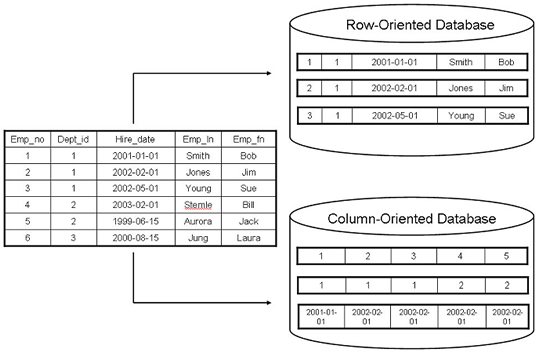

# Clickhouse

## I. Row-Orientated Database vs Column-Orientated Database

Trong SQL, hệ thống lưu trữ có thể phân ra làm 2 loại:

- Row-Oriented Database:
Là loại cơ sở dữ liệu mà dữ liệu được lưu trữ theo hàng. Mỗi hàng chứa thông tin đầy đủ cho một bản ghi, điều này giúp tối ưu hóa việc truy cập và cập nhật dữ liệu theo hàng.


- Column-Oriented Database:
Là loại cơ sở dữ liệu mà dữ liệu được lưu trữ theo cột. Mỗi cột chứa tất cả các giá trị cho một thuộc tính nhất định của tất cả các bản ghi, giúp tối ưu hóa cho các truy vấn phân tích và tổng hợp dữ liệu.




| Tiêu chí so sánh               | Row-Orientated Database                | Column-Orientated Database           |
|---------------------------|----------------------------------------|--------------------------------------|
| **Cấu trúc lưu trữ**     | Dữ liệu được lưu trữ theo hàng.      | Dữ liệu được lưu trữ theo cột.     |
| **Tối ưu hóa**            | Tối ưu cho các truy vấn ghi và đọc theo hàng. | Tối ưu cho các truy vấn đọc theo cột. |
| **Hiệu suất truy vấn**    | Tốt cho truy vấn với nhiều cột và ít bản ghi. | Tốt cho truy vấn với ít cột và nhiều bản ghi. |
| **Sử dụng bộ nhớ**        | Tiêu tốn bộ nhớ nhiều hơn cho các truy vấn đọc. | Tiết kiệm bộ nhớ cho các truy vấn phân tích. |
| **Thời gian truy vấn**    | Thời gian truy vấn nhanh hơn cho các truy vấn ghi. | Thời gian truy vấn nhanh hơn cho các truy vấn phân tích lớn. |
| **Phân tích dữ liệu**     | Không hiệu quả cho các truy vấn phân tích lớn. | Hiệu quả cho các truy vấn phân tích và báo cáo. |
| **Mô hình dữ liệu**       | Thích hợp cho ứng dụng OLTP (Online Transaction Processing). | Thích hợp cho ứng dụng OLAP (Online Analytical Processing). |

## II. Khái niệm:

ClickHouse là một hệ quản trị cơ sở dữ liệu mã nguồn mở có khả năng mở rộng cao, sử dụng cấu trúc theo cột. Nó được thiết kế cho xử lý phân tích trực tuyến (OLAP) và có hiệu suất rất cao. ClickHouse có thể trả về kết quả đã xử lý trong thời gian thực chỉ trong vài phần giây. Điều này làm cho nó trở nên lý tưởng cho các ứng dụng làm việc với các tập dữ liệu có cấu trúc lớn: phân tích dữ liệu, báo cáo dữ liệu phức tạp, tính toán khoa học dữ liệu


ClickHouse ban đầu được xây dựng như một nguyên mẫu để thực hiện một nhiệm vụ duy nhất một cách hiệu quả: lọc và tổng hợp dữ liệu nhanh nhất có thể thông qua truy vấn GROUP BY.Sau đó ClickHouse đã đưa ra một số quyết định, khi kết hợp lại, đã giúp thực hiện nhiệm vụ này:


- Lưu trữ theo cột: Dữ liệu nguồn thường chứa hàng trăm hoặc thậm chí hàng nghìn cột, trong khi một báo cáo chỉ có thể sử dụng một vài cột. Hệ thống cần tránh việc đọc các cột không cần thiết để tránh các thao tác đọc đĩa tốn kém.

- Chỉ mục: Các cấu trúc dữ liệu của ClickHouse lưu trong bộ nhớ cho phép đọc chỉ các cột cần thiết và chỉ các khoảng hàng cần thiết của những cột đó.

- Nén dữ liệu: Việc lưu trữ các giá trị khác nhau của cùng một cột lại với nhau thường dẫn đến tỷ lệ nén tốt hơn (so với các hệ thống theo hàng) vì trong dữ liệu thực tế, một cột thường có cùng một hoặc không nhiều giá trị khác nhau cho các hàng liền kề. Ngoài việc nén thông thường, ClickHouse hỗ trợ các codec chuyên dụng có thể làm cho dữ liệu compact hơn nữa.

- Thực thi truy vấn theo dạng vector: ClickHouse không chỉ lưu trữ dữ liệu theo cột mà còn xử lý dữ liệu theo cột. Điều này dẫn đến việc sử dụng tốt hơn bộ nhớ cache của CPU và cho phép sử dụng các lệnh SIMD của CPU.

- Khả năng mở rộng: ClickHouse có thể tận dụng tất cả các lõi CPU và đĩa có sẵn để thực hiện thậm chí một truy vấn đơn. Không chỉ trên một máy chủ mà còn trên tất cả các lõi CPU và đĩa của một cụm.

- Xử lý truy vấn trên nhiều máy chủ: ClickHouse hỗ trợ xử lý truy vấn phân tán với dữ liệu được lưu trữ trên các shard khác nhau. Các truy vấn lớn được thực hiện song song qua nhiều lõi và sử dụng các tài nguyên cần thiết.

## III. Cài đặt & sử dụng Clickhouse:

ClickHouse hỗ trợ một ngôn ngữ truy vấn khai báo dựa trên SQL giống với chuẩn ANSI SQL. Các truy vấn được hỗ trợ bao gồm GROUP BY, ORDER BY, các truy vấn con trong phần FROM, câu lệnh JOIN, toán tử IN, các hàm cửa sổ và các truy vấn con vô hướng.
Vì vậy, sử dụng Clickhouse sẽ tương đối dễ dàng cho những người đã sử dụng các hệ quản trị cơ sở dữ liệu SQL khác như MySQL, PostgreSQL

- Cài đặt Clickhouse:
```
echo "deb http://repo.yandex.ru/clickhouse/deb/stable/ main/" | sudo tee /etc/apt/sources.list.d/clickhouse.list

sudo apt update

sudo apt install clickhouse-server clickhouse-client

sudo service clickhouse-server start
```

- Sau khi cài đặt xong, ta cần bắt đầu 1 client session để khởi tạo 1 cơ sở dữ liệu:

```
clickhouse-client --password
```

- Sau đó, ta có thể chạy các lệnh thông thường như trong SQL để tạo cơ sở dữ liệu và bảng mới:

```
CREATE DATABASE hieu
```
- Đối với lệnh tạo bảng:
```
CREATE TABLE hieu.my_table (
    id UInt32,
    name String
) ENGINE = MergeTree()
ORDER BY id;
```
- Sau đó, ta có thể thực hiện các câu lệnh truy vấn thông thường như INSERT INTO, SELECT, ALTER,....

- Đối với việc cài đặt clickhouse chạy trên nhiều máy chủ, sau khi cài đặt clickhouse ở mỗi máy chủ, ta cần phải cấu hình lại `config.xml` như sau:

```
## Ở mục remote server:
## Dưới đây là một ví dụ cấu hình cho một cụm với 3 shard, mỗi shard có 1 replica.

<remote_servers>
    <cluster_1>
        <shard>
            <replica>
                <host>192.168.1.1</host>
                <port>9000</port>
            </replica>
        </shard>
        <shard>
            <replica>
                <host>192.168.1.2</host>
                <port>9000</port>
            </replica>
        </shard>
        <shard>
            <replica>
                <host>192.168.1.3</host>
                <port>9000</port>
            </replica>
        </shard>
    </cluster_1>
</remote_servers>
```
- Shard: một phần của dữ liệu được phân chia trong cơ sở dữ liệu phân tán. Mỗi shard chứa một phần dữ liệu riêng biệt, giúp phân tán tải công việc và tăng cường khả năng mở rộng.
- Replica: bản sao của một shard. Mỗi replica chứa cùng một phần dữ liệu như shard gốc, và nó được sử dụng để dự phòng và đảm bảo tính khả dụng của dữ liệu.

Sau đó, ta cần tạo 1 bảng phân tán thông qua lệnh:
```
CREATE TABLE hieu.my_table_distributed AS hieu.my_table
ENGINE = Distributed(cluster_1,hieu, my_table, rand());
```
Trong thực tế, thường ta sẽ tạo ra các bảng phân tán tương tự trên tất cả các máy trong cụm. Điều này cho phép thực hiện các truy vấn phân tán trên bất kỳ máy nào trong cụm. Cũng có một lựa chọn khác là tạo một bảng phân tán tạm thời cho một truy vấn SELECT nhất định bằng cách sử dụng hàm bảng từ xa.


