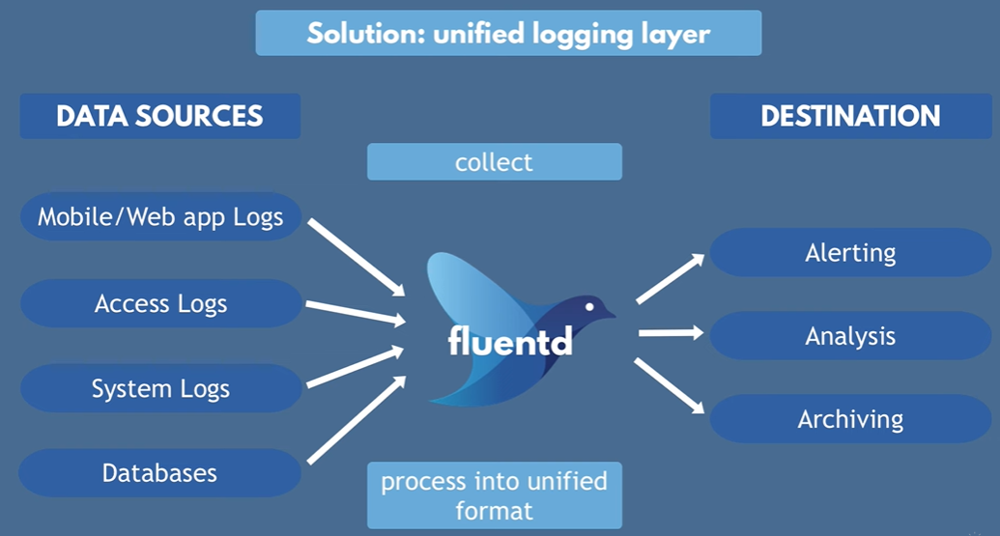
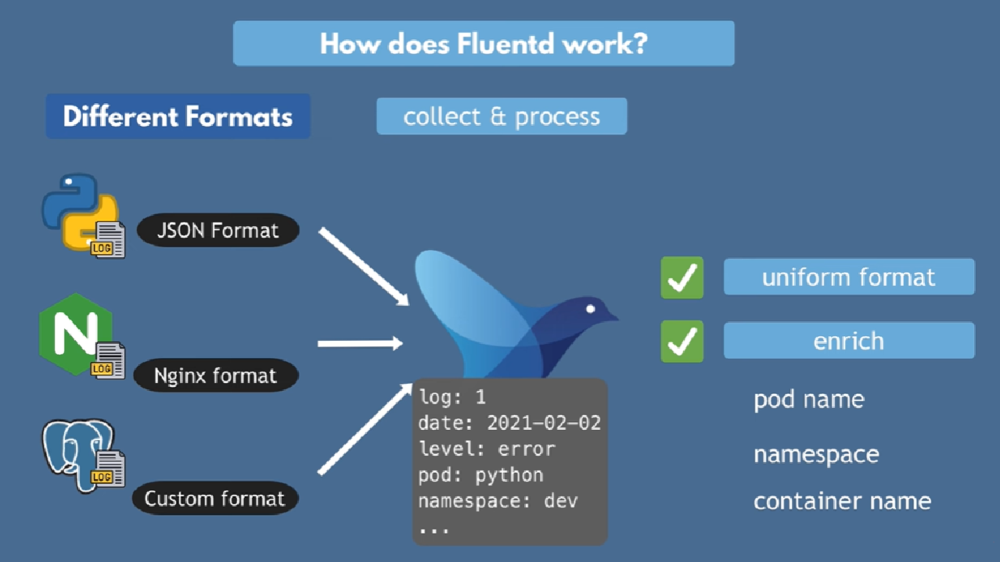
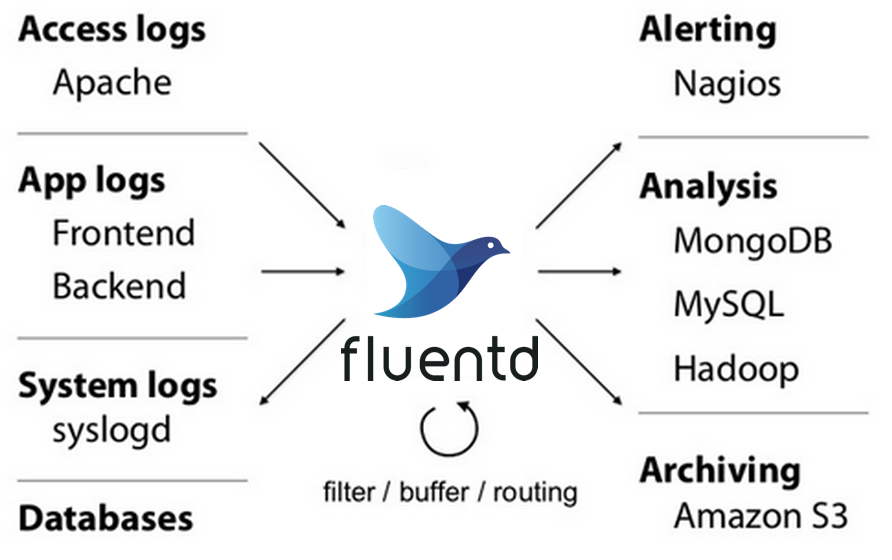

# Fluentd

## I. Khái niệm:
Fluentd là một trình thu thập và chuyển tiếp log mã nguồn mở. Nó giúp thu thập dữ liệu từ nhiều nguồn khác nhau, chuyển đổi chúng thành cùng một format và gửi tới nhiều đích khác nhau, với mục đích phân tích hoặc cảnh báo.



Fluentd có thể được coi là một dạng ESB, nhưng thay vì xử lý dữ liệu ứng dụng, Fluentd chuyên về việc thu thập và xử lý các sự kiện log.

- ESB hay Enterprise Service Bus là một dạng middleware được thiết kế để kết nối, quản lý và tích hợp các ứng dụng và dịch vụ trong một tổ chức, truyền dữ liệu giữa các phần mềm gần như thời gian thực.

## II. Cách thức hoạt động:

Fluentd thu thập dữ liệu từ các nguồn khác nhau thông qua các plugin input. Các nguồn có thể là file log, cơ sở dữ liệu, API, hoặc các dịch vụ khác. 

Sau khi thu thập, dữ liệu có thể được xử lý qua các plugin filter, cho phép chuyển đổi, làm sạch, hoặc lọc thông tin và thêm các trường tự định nghĩa trước khi gửi đi.

Cuối cùng, dữ liệu đã được xử lý sẽ được gửi tới các đích khác nhau thông qua các plugin output, như cơ sở dữ liệu, kho lưu trữ log, hoặc các dịch vụ phân tích.



Ta có thể tự định tuyến hướng di chuyển của các log, cụ thể như đưa các log trong một ứng dụng đến mongodb hoặc Kafka, log của các ứng dụng sẽ đến elastic search,......



Thường một kịch bản định tuyến cho các log sẽ có cấu trúc như sau:

```
<source>
  @type forward
</source>

<filter app.**>
  @type record_transformer
  <record>
    hostname "#{Socket.gethostname}"
  </record>
</filter>

<match app.**>
  @type file
  # ...
</match>
```

- \<Source>: định nghĩa nguồn dữ liệu mà Fluentd sẽ thu thập. Có thể cấu hình các plugin input tại đây để lấy dữ liệu từ nhiều nguồn khác nhau như file log, API, hoặc các dịch vụ khác
- \<filter>: xử lý và biến đổi dữ liệu đã thu thập như thay đổi nội dung của bản ghi log, như thêm, sửa đổi hoặc xóa các trường,....
- \<match>:  định nghĩa cách dữ liệu sẽ được gửi đến các đích khác nhau.

Dưới đây là một ví dụ cơ bản về cấu hình Fluentd để thực hiện file routing. Cấu hình này sẽ thu thập log từ một app   export ra cổng 8888, thêm trường thời gian vào mỗi bản ghi log và gửi dữ liệu đến MongoDB hoặc Elasticsearch.

```
<source>
  @type http
  port 8888
  format json  # Định dạng log là JSON
  tag nodejs.app  # Nhãn cho dữ liệu này
</source>

<filter nodejs.app>
  @type record_transformer
  <record>
    timestamp ${time.now}  # Thêm trường thời gian vào bản ghi
  </record>
</filter>

<match nodejs.app>
  @type elasticsearch  
  host localhost  # Địa chỉ của Elasticsearch
  port 9200  # Cổng của Elasticsearch 
  logstash_format true  # Định dạng logstash cho Elasticsearch
  index_name nodejs_logs  # Tên index trong Elasticsearch
</match>
```

Ngoài ra, ta còn có thêm trường \<label>:
- \<label>:  cho phép nhóm các cấu hình lại với nhau, giúp quản lý và tổ chức các quy tắc xử lý.

```
<match worker.**>
  @type route
  remove_tag_prefix worker
  add_tag_prefix metrics.event

  <route **>
    copy # For fall-through. Without copy, routing is stopped here. 
  </route>
  <route **>
    copy
    @label @BACKUP
  </route>
</match>

<match metrics.event.**>
  @type stdout
</match>

<label @BACKUP>
  <match metrics.event.**>
    @type file
    path /var/log/fluent/backup
  </match>
</label>
```