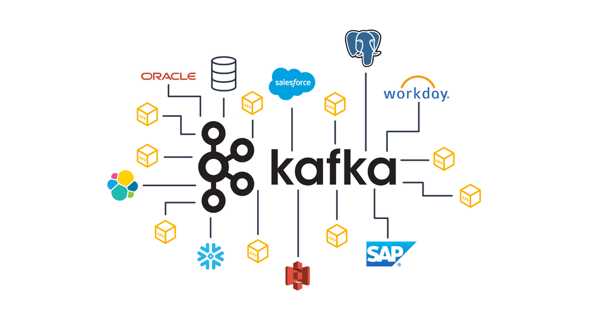
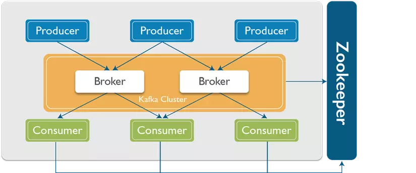

# Apache Kafka

## I. Khái niệm:

Event streaming là quá trình ghi lại và xử lý dữ liệu theo thời gian thực từ nhiều nguồn khác nhau, cho phép lưu trữ, thao tác và định tuyến dữ liệu một cách hiệu quả. Nó giống như hệ thống thần kinh của con người, đảm bảo thông tin luôn có sẵn và chính xác tại thời điểm cần thiết, tại các địa điểm cần thiết.

Apache Kafka là một nền tảng event streaming kết hợp ba khả năng chính để bạn có thể triển khai các trường hợp sử dụng của mình cho event streaming từ đầu đến cuối:

- Xuất bản và đăng ký các dòng sự kiện, bao gồm việc nhập/xuất dữ liệu liên tục từ các hệ thống khác.
- Lưu trữ các dòng sự kiện một cách bền vững và đáng tin cậy trong thời gian bạn muốn.
- Xử lý các dòng sự kiện khi chúng xảy ra hoặc hồi cứu.

Tất cả các chức năng này được cung cấp theo cách phân tán, có khả năng mở rộng cao, linh hoạt, chịu lỗi và an toàn. Kafka có thể được triển khai trên phần cứng bare-metal, máy ảo và container, cả tại chỗ lẫn trên đám mây. Bạn có thể chọn giữa việc tự quản lý môi trường Kafka của mình và sử dụng các dịch vụ được quản lý hoàn toàn do nhiều nhà cung cấp khác nhau cung cấp.




## II. Cấu trúc của Apache Kafka:

Trong Apache Kafka, các thành phần chính bao gồm producer, broker, consumer, và Zookeeper.

- Producer: một ứng dụng hoặc dịch vụ gửi (xuất bản) dữ liệu (sự kiện) vào các topic trong Kafka. Đây là đầu vào của luồng dữ liệu trong kafka
- Broker: một server Kafka, giữ vai trò là trung gian nhận và lưu trữ các dòng sự kiện. Mỗi broker lưu trữ một phần của dữ liệu trong các partition của các topic. Kafka thường có nhiều broker, tạo thành một cluster nhằm tăng tính HA. Các broker làm việc cùng nhau để cung cấp tính khả dụng và khả năng mở rộng, đồng thời đảm bảo dữ liệu được lưu trữ một cách đáng tin cậy
- Consumer là một ứng dụng hoặc dịch vụ nhận (đọc) dữ liệu từ các topic trong Kafka. Consumers đăng ký (subscribe) vào các topic và nhận dữ liệu từ đó. Mỗi consumer trong cùng một group sẽ nhận các message khác nhau từ các partition của topic. Đây là đầu ra của luồng dữ liệu trong kafka.

- Zookeeper: dịch vụ quản lý cấu hình và đồng bộ hóa được sử dụng bởi Kafka.  Zookeeper quản lý thông tin metadata về cluster Kafka, bao gồm thông tin về các broker, các topic, và các partition. Nó giúp theo dõi trạng thái của các broker và đảm bảo tính nhất quán trong cluster.




Kafka được tối ưu hóa cho thông lượng cao. Nó được thiết kế để di chuyển một lượng lớn bản ghi trong khoảng thời gian ngắn. dựa trên 2 thiết kết:
- I/O tuần tự: kafka tận dụng được tốc độ của đọc/ghi tuần tự so với đọc ghi ngẫu nhiên thông qua việc sử dụng cơ chế chỉ ghi (Append-only) trong các partition. Khi một producer gửi một bản ghi đến Kafka, bản ghi đó được thêm vào cuối partition của topic. Mỗi bản ghi mới nhận được một offset duy nhất, cho phép phân biệt giữa các bản ghi. Tương tự, khi consumer đọc dữ liệu từ một partition, nó cũng đọc dữ liệu theo thứ tự. Điều này có nghĩa là consumer sẽ nhận các bản ghi theo thứ tự mà chúng được ghi vào partition

- Read with zero copy:  Zero copy cho phép hệ thống truyền dữ liệu từ đĩa trực tiếp đến socket mà không cần phải sao chép qua bộ nhớ trung gian. Điều này có nghĩa là dữ liệu không cần phải được đọc vào bộ nhớ RAM trước khi được gửi đến consumer.  Zero copy rất có lợi trong các tình huống mà Kafka cần đọc và gửi một lượng lớn dữ liệu đến consumer, như trong trường hợp xử lý log hoặc truyền tải dữ liệu lớn.


## III. Quy trình cơ bản của apache kafka:
Quy trình cơ bản của một luồng apache kafka gồm các bước:
- Tạo topic trên Kafka broker.
- Producer gửi dữ liệu đến topic đã tạo.
- Consumer subcribe và nhận dữ liệu từ các topic.


Ví dụ, giả sử ta có:
- Producer chạy trên địa chỉ IP: 192.168.1.100
- Consumer chạy trên địa chỉ IP: 192.168.1.101
- Broker chạy trên địa chỉ IP: 192.168.1.102

Khởi động Zookeeper và Kafka Broker trên máy Broker
 ```
bin/zookeeper-server-start.sh config/zookeeper.properties
bin/kafka-server-start.sh config/server.properties
 ```

Trên máy chủ Broker, tạo topic topic-1:
```
bin/kafka-topics.sh --create --topic topic-1 --bootstrap-server localhost:9092 --partitions 1 --replication-factor 1
```

Trên máy chủ Producer, chạy producer:
```
bin/kafka-console-producer.sh --topic topic-1 --bootstrap-server 192.168.1.102:9092
```

Trên máy chủ consumer, chạy consumer:
```
bin/kafka-console-consumer.sh --topic topic-1 --from-beginning --bootstrap-server 192.168.1.102:9092
```

Sau đó, ta có thể gửi thông điệp từ producer tới consumer thông qua các topic. 

